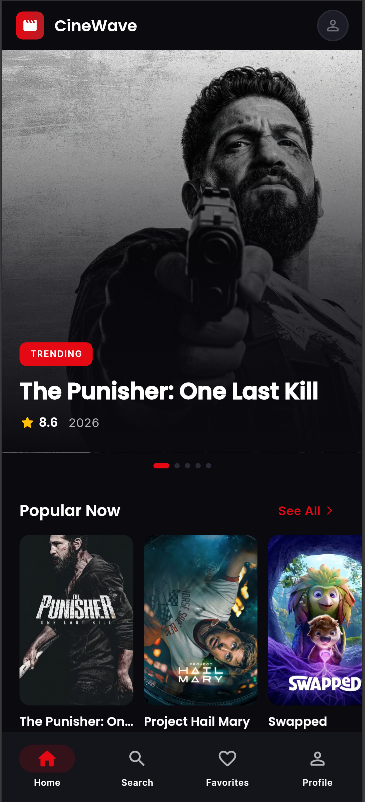
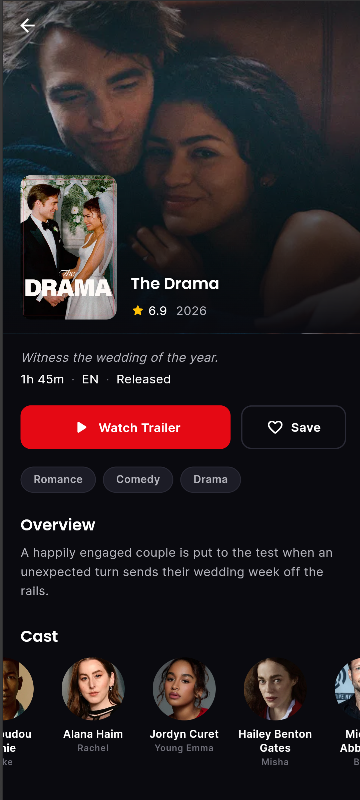
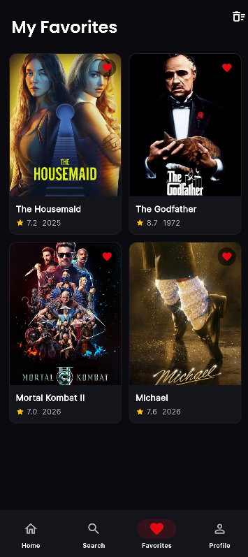
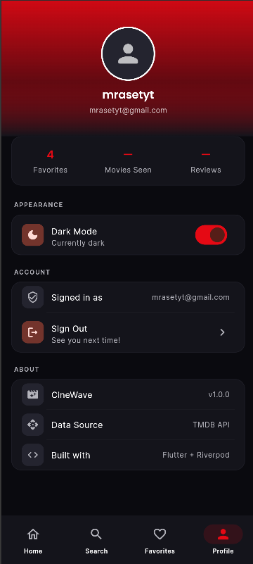

<div align="center">

# CineWave

**A modern, cinema-grade movie discovery app built with Flutter.**

Browse trending blockbusters, dive into rich movie details with trailers and cast,
save favorites for offline access, and personalize your experience — all wrapped
in a polished dark/light UI.

[](https://flutter.dev)
[](https://dart.dev)
[](https://riverpod.dev)
[](#architecture)
[](https://www.themoviedb.org/)
[](#license)

</div>

---

## Table of Contents

- [Overview](#overview)
- [Features](#features)
- [Screenshots](#screenshots)
- [Tech Stack](#tech-stack)
- [Architecture](#architecture)
- [Project Structure](#project-structure)
- [Getting Started](#getting-started)
- [Environment Configuration](#environment-configuration)
- [Build & Run](#build--run)
- [Requirements Mapping](#requirements-mapping)
- [Team](#team)
- [License](#license)
- [Acknowledgments](#acknowledgments)

---

## Overview

**CineWave** is a Flutter application that delivers a Netflix-style movie discovery
experience powered by [TMDB](https://www.themoviedb.org/). It was built as a final
project to demonstrate mastery of **state management, local & cloud persistence,
declarative navigation, and complex responsive UI layouts**.

The app showcases an end-to-end production-quality architecture:

- A **typed networking layer** via Chopper with JSON-serialized DTOs.
- A **reactive state layer** powered by Riverpod providers across feature modules.
- **Offline-first favorites** backed by Drift (SQLite) with reactive streams.
- **Cloud authentication** via Firebase Auth (email/password).
- **User preferences** (theme toggle) persisted with SharedPreferences.
- A custom **dark/light cinema theme** with gradients, shimmer skeletons, and
  smooth page transitions.

---

## Features

### Discover
- **Curated home feed** with four dynamic sections: *Trending This Week*,
  *Popular Now*, *Coming Soon*, and *Top Rated*.
- **Hero carousel** featuring auto-playing trending titles with smooth page
  indicators.
- **Horizontal scrollers** with shimmer loading placeholders and graceful error
  retry states.
- **Pull-to-refresh** to invalidate cached data on demand.

### Movie Details
- Rich detail page with **backdrop, poster, synopsis, runtime, release date,
  genres, and rating**.
- **Cast & crew** fetched from `/movie/{id}/credits`.
- **Embedded YouTube trailer** playback via `youtube_player_flutter`.
- **Similar movies** suggestions for endless discovery.

### Search
- Live **TMDB search** with debounced queries.
- Paginated results with infinite scroll.

### Favorites (Offline)
- One-tap **favorite toggle** from anywhere in the app.
- Stored locally using **Drift (SQLite)** — works fully offline.
- Reactive `Stream<List<FavoriteMovie>>` keeps every screen in sync.

### Authentication
- **Firebase Auth** with email/password sign-in and registration.
- Friendly, mapped error messages (invalid credentials, weak password, etc.).
- Auth state is reactively exposed across the app via a `StreamProvider`.

### Personalization
- **Dark / Light theme** toggle, persisted with SharedPreferences.
- Custom typography via Google Fonts.
- Animated splash, slide transitions for auth pages, and a fluid bottom-nav shell.

---

## Screenshots

| Home | Detail | Favorites | Profile |
| :--: | :----: | :-------: | :-----: |
|  |  |  |  |

---

## Tech Stack

| Layer | Package | Purpose |
| ----- | ------- | ------- |
| **UI** | `flutter`, `google_fonts`, `cached_network_image`, `shimmer`, `lottie` | Material 3 widgets, fonts, image caching, skeleton loaders, animations |
| **State** | `flutter_riverpod`, `riverpod_annotation` | Reactive state + DI across feature modules |
| **Routing** | `go_router` | Declarative routing with shell routes, sub-routes & custom transitions |
| **Networking** | `chopper`, `http`, `json_annotation` | Typed REST client + JSON serialization |
| **Local DB** | `drift`, `drift_flutter`, `sqlite3_flutter_libs` | Type-safe SQLite for favorites |
| **Preferences** | `shared_preferences` | Lightweight key-value storage (theme) |
| **Cloud** | `firebase_core`, `firebase_auth`, `cloud_firestore` | Auth & cloud persistence |
| **Media** | `youtube_player_flutter`, `carousel_slider`, `smooth_page_indicator` | Trailer playback & carousels |
| **Functional** | `dartz` | `Either<Failure, T>` repository return types |
| **Tooling** | `build_runner`, `chopper_generator`, `drift_dev`, `json_serializable`, `riverpod_generator` | Code generation |
| **Utilities** | `flutter_dotenv`, `intl`, `logger`, `url_launcher`, `connectivity_plus` | Env config, formatting, logging |

---

## Architecture

CineWave follows **Clean Architecture** principles. Each feature is split into
three layers that depend inward only:

```
┌──────────────────────────────────────────────────────────┐
│  Presentation  →  Pages • Widgets • Riverpod Providers   │
├──────────────────────────────────────────────────────────┤
│  Domain        →  Entities • Repositories (abstract)     │
│                   • UseCases                             │
├──────────────────────────────────────────────────────────┤
│  Data          →  DTOs (JSON) • Repository Impls         │
│                   • Chopper Services • Drift DAOs        │
└──────────────────────────────────────────────────────────┘
```

**Why this matters:**

- **Domain** is pure Dart — no Flutter, no Firebase, no HTTP. Easy to unit test.
- **Data** owns external concerns (Chopper, Drift, Firebase). Swappable.
- **Presentation** never touches `http` or `drift` directly — it talks to
  domain repositories via Riverpod providers.
- **Failures** are modeled with `dartz`'s `Either<Failure, T>` so success and
  error paths are explicit.

### State Management

All app state flows through **Riverpod** providers:

| Provider | Type | Responsibility |
| -------- | ---- | -------------- |
| `chopperClientProvider` | `Provider` | Singleton HTTP client with interceptors |
| `movieApiServiceProvider` | `Provider` | Typed Chopper TMDB service |
| `trendingMoviesProvider`, `popularMoviesProvider`, `upcomingMoviesProvider`, `topRatedMoviesProvider` | `FutureProvider` | Home feed sections |
| `movieDetailProvider` | `FutureProvider.family` | Per-movie detail fetch |
| `favoritesStreamProvider` | `StreamProvider` | Reactive Drift query |
| `authStateProvider` | `StreamProvider` | Firebase auth stream |
| `authControllerProvider` | `StateNotifierProvider` | Sign-in/register flow state |
| `themeProvider` | `NotifierProvider` | Theme mode persisted via SharedPreferences |

### Navigation

Implemented with **`go_router`** — fully declarative.

- A `ShellRoute` wraps the four tab destinations (`/home`, `/search`,
  `/favorites`, `/profile`) inside a persistent `MainShell` with a bottom
  navigation bar.
- Deep routes (`/movie/:id`, `/movies/:category`) live outside the shell so
  they cover the full screen.
- Auth pages (`/login`, `/register`) use custom slide-up transitions via
  `CustomTransitionPage`.

---

## Project Structure

```
lib/
├── main.dart                        # Bootstraps Firebase, dotenv, ProviderScope
├── app.dart                         # MaterialApp.router + theme wiring
├── firebase_options.dart            # Generated by FlutterFire CLI
│
├── core/                            # Cross-cutting concerns
│   ├── config/api_config.dart       # TMDB env-driven configuration
│   ├── error/failures.dart          # Sealed failure types
│   ├── network/auth_interceptor.dart# Injects TMDB bearer token
│   ├── providers/                   # chopper, theme, shared_preferences
│   ├── router/                      # go_router config + route constants
│   ├── theme/                       # AppColors, AppTheme, AppTypography
│   ├── utils/image_url_builder.dart # TMDB image URL helpers
│   └── widgets/                     # MainShell, splash, login-required gate
│
├── database/                        # Drift database
│   ├── app_database.dart            # @DriftDatabase definition
│   ├── favorites_table.dart         # FavoriteMovies table schema
│   ├── favorites_dao.dart           # CRUD + reactive watchers
│   ├── database_providers.dart      # Riverpod wiring
│   └── connection/                  # Platform-specific connection (web vs native)
│
└── features/
    ├── auth/         { data | domain | presentation }
    ├── home/         { data | domain | presentation }
    ├── movie_detail/ { data | domain | presentation }
    ├── search/       { data | presentation }
    ├── favorites/    { data | domain | presentation }
    └── profile/      { presentation }
```

Each feature module mirrors the Clean Architecture layering: `data/` holds DTOs
and Chopper services, `domain/` holds entities and abstract repositories, and
`presentation/` holds pages, widgets, and Riverpod providers.

---

## Getting Started

### Prerequisites

- **Flutter SDK** `>= 3.11.1` ([install guide](https://docs.flutter.dev/get-started/install))
- **Dart SDK** `^3.11.1` (bundled with Flutter)
- A **TMDB API key** — get one free at <https://www.themoviedb.org/settings/api>
- A **Firebase project** with Email/Password authentication enabled
- Platform tooling:
  - **Android**: Android Studio + Android SDK 21+
  - **iOS**: Xcode 15+ (macOS only)
  - **Web**: Chrome (already set up)

### 1. Clone the repository

```bash
git clone https://github.com/<your-org>/cinewave.git
cd cinewave
```

### 2. Install dependencies

```bash
flutter pub get
```

### 3. Generate code

CineWave uses code generation for Chopper, Drift, JSON serialization, and
Riverpod. Run:

```bash
dart run build_runner build --delete-conflicting-outputs
```

> For active development, run `dart run build_runner watch` instead.

---

## Environment Configuration

Create a `.env` file in the **project root** (same level as `pubspec.yaml`):

```dotenv
TMDB_API_KEY=your_tmdb_v4_bearer_token_here
TMDB_BASE_URL=https://api.themoviedb.org/3
TMDB_IMAGE_BASE_URL=https://image.tmdb.org/t/p
```

The `.env` file is registered as a Flutter asset in `pubspec.yaml` and loaded
at startup via `flutter_dotenv`.

### Firebase setup

1. Install the FlutterFire CLI: `dart pub global activate flutterfire_cli`
2. From the project root, run: `flutterfire configure`
   - This regenerates `lib/firebase_options.dart` for your project.
3. In the Firebase console, enable **Authentication → Sign-in method →
   Email/Password**.

> Do **not** commit `.env` or platform-specific Firebase config files
> (`google-services.json`, `GoogleService-Info.plist`) to a public repo.

---

## Build & Run

```bash
# Run on the connected device / emulator (debug)
flutter run

# Pick a specific device
flutter devices
flutter run -d chrome           # Web
flutter run -d windows          # Windows desktop

# Release builds
flutter build apk --release
flutter build appbundle --release
flutter build ios --release
flutter build web --release
```

### Useful scripts

```bash
flutter analyze                            # Static analysis (lints)
flutter test                               # Run unit/widget tests
dart run build_runner build --delete-conflicting-outputs
dart run build_runner watch                # Re-generate on file changes
```

---

## Requirements Mapping

How CineWave satisfies the **Final Project Requirements** rubric:

| Requirement | Implementation |
| ----------- | -------------- |
| **Responsive UI** with `Scaffold`, `Column`, `Row`, `Container` | Used throughout every page (see [`home_page.dart`](lib/features/home/presentation/pages/home_page.dart), [`profile_page.dart`](lib/features/profile/presentation/pages/profile_page.dart)) |
| **Slivers / GridView** complex scrollable view | `CustomScrollView` + `SliverAppBar` + `SliverToBoxAdapter` on Home; `GridView` on Favorites & Movie List |
| **Interactive widgets** | Carousel slider, page indicators, pull-to-refresh, animated theme toggle, GestureDetectors |
| **Declarative navigation with `go_router`** | [`core/router/app_router.dart`](lib/core/router/app_router.dart) — `ShellRoute` for tabs, sub-routes for detail/list, `CustomTransitionPage` for auth |
| **Back-stack management** | `context.push` for stackable detail pages, `context.go` for tab switches |
| **Clean Architecture** (UI / Domain / Data) | Every feature module is split into `data/`, `domain/`, `presentation/` |
| **Riverpod** for state + DI | All services, repositories, and view-models are exposed as Riverpod providers |
| **Chopper** for HTTP | [`movie_api_service.dart`](lib/features/home/data/services/movie_api_service.dart) defines a typed TMDB client |
| **JSON serialization to Dart models** | DTOs (`movie_dto.dart`, `movie_response_dto.dart`) generated via `json_serializable`, mapped to domain entities |
| **Shared Preferences** for lightweight settings | Theme mode persisted in [`theme_provider.dart`](lib/core/providers/theme_provider.dart) |
| **Drift (SQLite)** for structured local data | Favorites stored via [`favorites_dao.dart`](lib/database/favorites_dao.dart) with reactive streams |
| **Firebase** integration | `firebase_auth` for email/password auth; `cloud_firestore` configured for future cloud sync of watchlists |
| **Loading & error states** | Every async UI uses `AsyncValue.when(...)` with shimmer placeholders and retry callbacks |

---

## Team

This project was developed as part of the *Cross-Platform Mobile Development* final assignment.

| Name | Role | GitHub |
| ---- | ---- | ------ |
| **Talant** | Architecture & Business Logic | [@Talantt0906](https://github.com/Talantt0906) |
| **Alisher** | Database & Persistence | [@alisherabushemenov1](https://github.com/alisherabushemenov1) |
| **Asset** | UI/UX & Theming | [@Set001YT](https://github.com/Set001YT) |

> *All participants contributed equally to the development of the corresponding architectural layers of the application.*
---

## License

This project is released under the [MIT License](LICENSE) for educational
purposes. Movie data and imagery are provided by **The Movie Database (TMDB)**
and remain subject to their [terms of use](https://www.themoviedb.org/terms-of-use).

> *This product uses the TMDB API but is not endorsed or certified by TMDB.*

---

## Acknowledgments

- [The Movie Database (TMDB)](https://www.themoviedb.org/) — for the open movie API.
- [Flutter](https://flutter.dev) & [Dart](https://dart.dev) teams.
- [Riverpod](https://riverpod.dev), [Drift](https://drift.simonbinder.eu),
  [go_router](https://pub.dev/packages/go_router), and
  [Chopper](https://pub.dev/packages/chopper) maintainers.
- Inspiration from Netflix, IMDB, and Letterboxd UI patterns.

<div align="center">

**Built with Flutter — ride the wave.**

</div>
